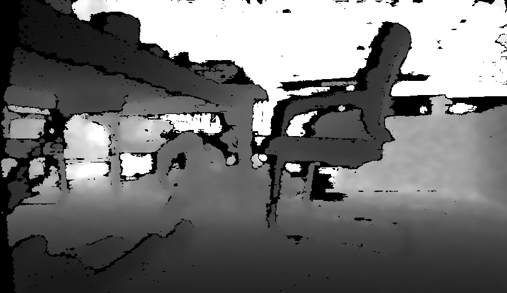
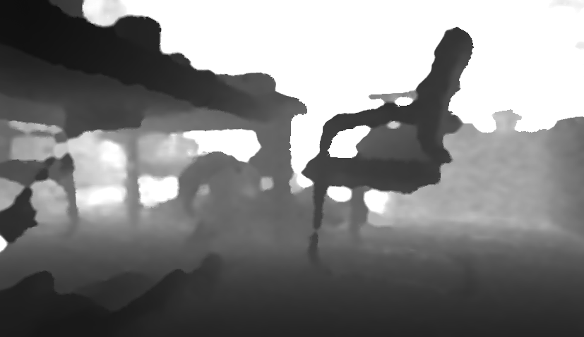

#  Python OpenCV-DepthCleaner


方便快捷的深度图处理工具，可以在python中使用。

Using OpenCV-DepthCleaner in python via pybind. Good for robotic tasks.

在使用realsense相机过程中，发现realsense库中的无效区域补全(holl filling)不好用，且互联网上即开即用的库很少，大部分是偏学术的、需要训练的深度模型。
在这里分享一个实用的深度图处理工具，效果很好，可以直接在python中使用，处理速度很快。非常适合在机器人项目中使用。


| origin          | cleaned        |
|:-------------------:|:------------------:|
|  |  |


### Start
1. Install Dependence: OpenCV pybind11 pyrealsense2


2. build the cpp module
```mkdir build
cd build
cmake ..
make
```

3. In python, using **import PyDepthInpaint** to import the cpp module. Make sure python could fine the .so file.
```
import sys
sys.path.append('./build')
import PyDepthInpaint
```


You can test the module's basic function by running. If everything ok, you can see a random matrix.
```
python module_test.py
```


Using realsense_example.py to connect to realsense and record depth video. 

```
python realsense_example.py
```


### inspired by [juniorxsound's project](https://github.com/juniorxsound/ThreadedDepthCleaner)
